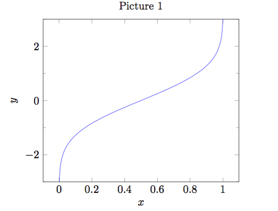
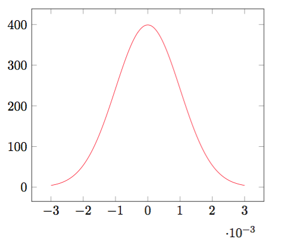
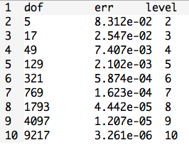
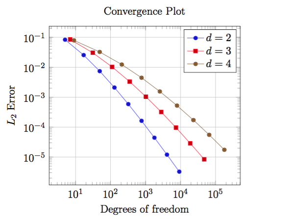
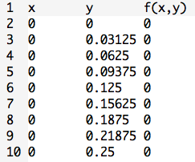
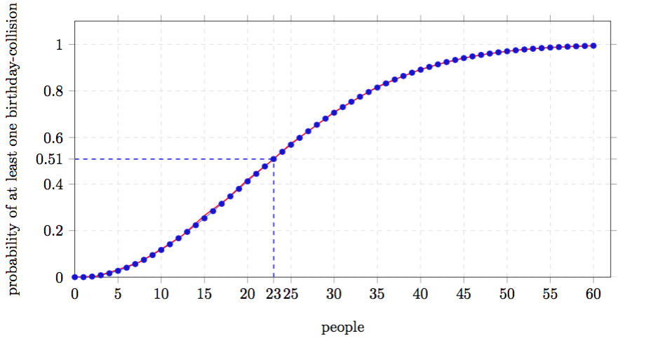

Before we start, the following packages and command are useful:

```latex
\usepackage{tikz} % To generate the plot from csv
\usepackage{pgfplots}
\pgfplotsset{compat=1.5}
```

## Plotting data from `.dat` files in LaTeX

### Using `\addplot table`

Ploting data directly from a `.dat` file. For example, if a file called `data.dat` has the data table shown as follows:

<!--more-->

```
x	f(x)
3.16693000e-05	-4.00001451e+00
1.00816962e-03	-3.08781504e+00
1.98466995e-03	-2.88058811e+00
2.96117027e-03	-2.75205040e+00
3.93767059e-03	-2.65736805e+00
4.91417091e-03	-2.58181091e+00
5.89067124e-03	-2.51862689e+00
6.86717156e-03	-2.46413745e+00
....
```

Using the following commands can generate the plots automatically.

```latex
\begin{tikzpicture}
\begin{axis}[
  title = {Picture 1},  % whatever name you want
  xlabel = {$x$},
  ylabel = {$y$},
  ymin = -3, ymax = 3,
  minor y tick num = 1,]
  \addplot[blue] table {data.dat};
\end{axis}
\end{tikzpicture
```

Then the corresonding plot will be:

<!-- if the above link doesn't work, use the following command -->


**REMARK:**

* `\begin{axis}... \end{axis}` is the environment for a normal axis.
* Axis descriptions can be added using the keys `title`, `xlabel`, `ylabel` as we have in our example listing.
* The keys `ymin`, `ymax`, `xmin`, `xmax` control only the *visible* part, i.e., the axis range.
* The third new option is `minor y tick num = 1` which allows to customize minor ticks.
* `\addplot[blue]` means that the plot will be placed in blue color, `\addplot table` loads a table from a file and plots the first two columns. The keyword `table` also accepts an option list (for example, to choose columns, to define a different `col sep` or `row sep` or to provide some math expression which is applied to each row).

### Using `\addplot expression`

Of course, we can also use another way to generate a plot. More precisely, `\addplot expression` can make it. For example:

```latex
\begin{tikzpicture}
\begin{axis}
  % density of Normal distribution:
  \newcommand\MU{0}
  \newcommand\SIGMA{1e-3}
  \addplot[red, domain = -3*\SIGMA: 3*\SIGMA, samples = 201,]
          {exp(-(x-\MU)^2 / 2 / \SIGMA^2) / (\SIGMA * sqrt(2*pi))};
\end{axis}
\end{tikzpicture}
```

The above commands can obtain the following plot:

<!-- if the above link doesn't work, use the following command -->


**REMARK:**

* `domain` defines the sampling interval in the form **a:b**.
* `samples = N` expects the number of samples inserted into the sampling interval.
* Here the `expression` is the density of Normal distribution.


### Dealing with multiple files simultaneously

We can read several data files at the same time and then plot them into one picture. 
For example, if we have three data files, each of them corresponds to one parameter *d*, which could be 2, 3 or 4. 
The data file for *d = 2* is stored in **data_d2.dat** and it contains the following data:

<!-- if the above link doesn't work, use the following command -->


The other files are similar.

If we wnat to produce a loglog plot, the following commands can make this happen:

```latex
\begin{tikzpicture}
\begin{loglogaxis}[
  title = {Convergence Plot},
  xlabel = {Degrees of freedom},
  ylabel = {$L_2$ Error},
  grid = major,
  legend entries = {$d=2$, $d=3$, $d = 4$},]
  \addplot table {data_d2.dat};
  \addplot table {data_d3.dat};
  \addplot table {data_d4.dat};
\end{loglogaxis}
\end{tikzpicture}
```
Here is the result:

<!-- if the above link doesn't work, use the following command -->


**REMARK:**

* We used `\begin{loglogaxis}` instead of `\begin{axis}` in order to configure logarithmic scales on both axes.
* The plot contains grid lines since we used the `grid = major` key.
* A legend can be provided for one or more `\addplot` statements using the `legend entries` key.
* `pgfplots` accepts more than one `\addplot ... ;` command, so we can just add our remaining data files.
* We do not need to worry about the line styles, since `pgfplots` will automatically choose styles for that specific plot.

### 3D Scatter Plots

This is similar to two dimensional plot. 
For example, if we have a file called ``data_3d.dat`` which contains the following data:

<!-- if the above link doesn't work, use the following command -->


Using the below commands can obtain the desired plot:

```latex
\begin{tikzpicture}
\begin{axis}[
  xlabel = $x$,
  ylabel = $y$,
  zlabel = {$f(x,y) = x \cdot y$},
  title = {A Scatter Plot Example},]
  \addplot3+[only marks, scatter] table {data_3d.dat};
\end{axis}
\end{tikzpicture}
```

<!-- if the above link doesn't work, use the following command -->


**REMARK:**

* The `\addplot3` command is the main interface for any three dimensional plot.
* `only marks` places the current plot *mark* at each input position.
* If we add the key `scatter`, the plot mark will also use the colors of the current `colormap`.


## Plotting data from `.csv` files in LaTeX

Similar to `.dat` file, we can also use `\addplot table` to import data from `.csv` file. Let's use the previos skills to deal with a relatively more complex example.

Here is data from `data.csv` file:

people	|	probability
------ |  ----
0	|	0.000000
1	|	0.000000
2	|	0.002740
3	|	0.008204
4	|	0.016356
5	|	0.027136
...|...

Then the following commands can help us obtain the below plot:

```latex
\begin{tikzpicture}
\begin{axis}[
  width=15cm, height=8cm,  % size of the image
  grid = major,
  grid style = {dashed, gray!30},
  % xmode=log,log basis x=10,
  % ymode=log,log basis y=10,
  xmin = 0,   % start the diagram at this x-coordinate
  xmax = 62,  % end   the diagram at this x-coordinate
  ymin = 0,   % start the diagram at this y-coordinate
  ymax = 1.1, % end   the diagram at this y-coordinate
  /pgfplots/xtick = {0,5,...,60},  % make steps of length 5
  extra x ticks = {23},
  extra y ticks = {0.507297},
  axis background/.style = {fill=white},
  ylabel = {probability of at least one birthday-collision},
  xlabel = {people},
  tick align = outside,]
  
  % import the correct data from a CSV file
  \addplot table {data.csv};

  % mark x=23
  \coordinate (a) at (axis cs:23, 0.507297);
  \draw[blue, dashed, thick](a -| current plot begin) -- (a);
  \draw[blue, dashed, thick](a |- current plot begin) -- (a);

  % plot the stirling-formulae
  \addplot[domain=0:60, red, thick] {1-(365/(365-x))^(365.5-x)*e^(-x)}; 
\end{axis} 
\end{tikzpicture}
```

<!-- if the above link doesn't work, use the following command -->


For more details about the package `pgfplots`, please download the pdf tutorial [Manual for Package PGFPLOTS](http://sourceforge.net/projects/pgfplots) as a reference.
